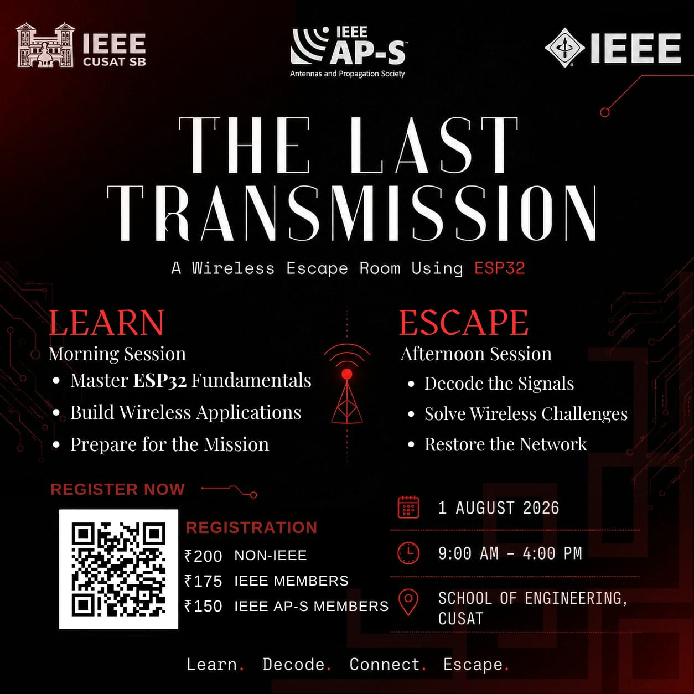

# The Last Transmission

The Last Transmission is an in-person ESP32 escape-room experience set in 2042. Participants help restore the damaged memory of EVA, the AI that once coordinated global communication, after an unknown signal causes the network to collapse.

## Overview

At 03:17:42 UTC on 13 July 2042, EVA receives a signal with no identifiable source, distance, or language. After exchanging information with it, EVA begins to fail. Its final beacon reaches a group chosen to recover the seven memory locations that humanity once used to divide and control EVA.

The identity of the unknown signal is deliberately withheld until the final room, making the experience feel like a mystery as well as a puzzle.

For the full facilitator narrative and stage flow, see [STORY_AND_STAGE_FLOW.md](STORY_AND_STAGE_FLOW.md).

## Event posters

<table>
  <tr>
    <td align="center">
      
    </td>
    <td align="center">
      
    </td>
  </tr>
</table>

## Story videos

<table>
  <tr>
    <td align="center" width="50%">
      <video src="https://github.com/user-attachments/assets/c379550b-3886-4411-80f1-b77bb3610164" controls width="420"></video>
    </td>
    <td align="center" width="50%">
      <video src="https://github.com/user-attachments/assets/b914cc87-652c-40ee-bdd0-6f3a4596f333" controls width="230"></video>
    </td>
  </tr>
</table>

## Stage map

| Room | Stage | Challenge | Main technology |
|---|---|---|---|
| 1 | EVA's Last Beacon | Receive EVA's emergency broadcast | ESP-NOW |
| 2 | Administrator Recovery | Unlock a memory archive and program an RFID card | RC522 + OLED |
| 3 | Companion-07 Memory Relay | Repeat a damaged memory sequence | ESP32 Wi-Fi web game |
| 4 | EVA Morse Archive | Enter and receive a Morse handoff | Touch sensor + RGB LED + buzzer |
| 5 | Encrypted Memory Cache | Decrypt EVA's damaged conversation | ESP32 Wi-Fi web terminal |
| 6 | Hidden Synchronization Cache | Send and receive a recovery request | Two-way ESP-NOW |
| 7 | The Final Transmission | Reconstruct the master key | Smartboard web page |

## What each room does

- Room 1 starts the story with EVA's beacon and gives the first recovered code.
- Room 2 uses an RFID-based administrator recovery step and reveals the next handoff.
- Room 3 is a browser-based memory game hosted on an ESP32 access point.
- Room 4 uses touch input and Morse output to transmit another code.
- Room 5 presents an encrypted conversation that must be decoded.
- Room 6 uses ESP-NOW to trigger a hidden recovery response.
- Room 7 accepts the recovered codes and reveals the final transmission.

## Current event configuration

Every stage currently uses the shared six-digit code:

`123456`

The Room 7 master-key format is:

`123456-123456-123456-123456-123456-123456`

The RFID write value in Room 2 is also `123456`. It acts as the administrator credential for that stage and is not an additional seventh key.

## Project layout

Each Arduino sketch is stored in its own folder so it can be opened and uploaded independently in the Arduino IDE.

- [Room 1 documentation](Stage1_ESPNOW/details.md)
- [Room 2 documentation](Stage2_RFID/doc.md)
- [Room 3 documentation](Stage3_Webserver/README.md)
- [Room 4 documentation](Stage4_morse/doc.md)
- [Room 5 documentation](Stage5_encryption/README.md)
- [Room 6 documentation](Stage6_relay_surgery/doc.md)
- [Room 7 documentation](Stage7_thefinal/README.md)

## Hardware and software requirements

### Software
- ESP32 Arduino core
- Arduino IDE or Arduino CLI
- A browser-capable phone, laptop, or smartboard for Rooms 2, 3, 5, 6, and 7

### Hardware
- Two ESP32 boards for Room 1 and Room 6
- One ESP32 board for the other hardware rooms
- RC522 RFID reader and compatible MIFARE card for Room 2
- SSD1306 OLED display for Room 2
- Touch sensor, RGB LED, and buzzer for Room 4
- A browser device for the web-based stages

### Libraries
- MFRC522
- Adafruit GFX
- Adafruit SSD1306

## Setup checklist

1. Read [STORY_AND_STAGE_FLOW.md](STORY_AND_STAGE_FLOW.md) before the event.
2. Upload the correct sketch from each stage's documented folder.
3. Verify the Wi-Fi, RFID, Morse, and ESP-NOW handoffs in room order.
4. Prepare any physical props or reference materials for the rooms.
5. Keep the final Room 7 key blank until the group reaches the last stage.

## Facilitator notes

- Start the Room 1 transmitter before participants begin.
- Keep the Morse reference table visible in Room 4.
- Display the Room 6 briefing page before participants arrive.
- Copy the Room 6 relay MAC address into the participant terminal before the event, or provide a clearly labelled setup step.
- Do not prefill the Room 7 master key.

## Quick start

If you want to run the project locally:

1. Install the ESP32 board package in the Arduino IDE.
2. Open the sketch folder for the room you want to test.
3. Select the correct ESP32 board and COM port.
4. Upload the sketch and open the Serial Monitor at 115200 baud when required.
5. Follow the room-by-room flow in the stage documentation.
